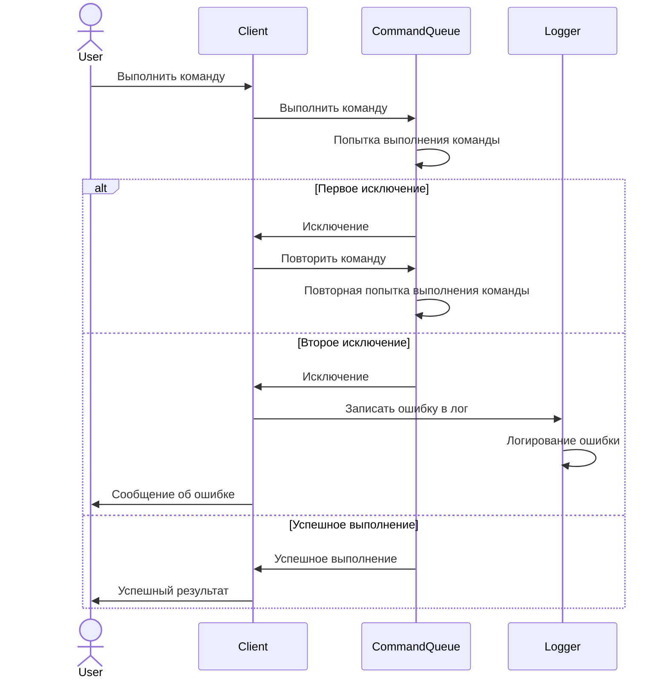

# Реализация игры "Космическая битва" на Python.

## 2. Движение игровых объектов по полю

**Цель:**

Выработка навыка применения SOLID принципов на примере игры "Космическая битва".

В результате выполнения ДЗ будет получен код, отвечающий за движение объектов по игровому полю, устойчивый к появлению новых игровых объектов и дополнительных ограничений, накладываемых на это движение.

**Критерии оценки:**

1. ДЗ сдано на проверку - 1 балл
2. Оформлен pull/merge request на github/gitlab - 1 балл
3. Настроен CI - 2 балла
4. Прямолинейное равномерное движение без деформации.
   1. Само движение реализовано в виде отдельного класса - 1 балл.
   2. Для движущихся объектов определен интерфейс, устойчивый к появлению новых видов движущихся объектов - 1 балл
   3. Реализован тесты - 1 балл:
      * Для объекта, находящегося в точке (12, 5) и движущегося со скоростью (-7, 3) движение меняет положение объекта на (5, 8).
      * Попытка сдвинуть объект, у которого невозможно прочитать положение в пространстве, приводит к ошибке.
      * Попытка сдвинуть объект, у которого невозможно прочитать значение мгновенной скорости, приводит к ошибке.
      * Попытка сдвинуть объект, у которого невозможно изменить положение в пространстве, приводит к ошибке.
5. Поворот объекта вокруг оси.
   1. Сам поворот реализован в виде отдельного класса - 1 балл
   2. Для поворачивающегося объекта определен интерфейс, устойчивый к появлению новых видов движущихся объектов - 1 балл 
   3. Реализованы тесты - 1 балл.

## 3. Механизм обработки исключений в игре "Космическая битва"

**Цель:**

Научится писать различные стратегии обработки исключений так, чтобы соответствующий блок try-catсh не приходилось модифицировать каждый раз, когда возникает потребность в обработке исключительной ситуации по-новому.

**Задачи:**

1. Обернуть вызов Команды в блок `try-catch`.
2. Обработчик `catch` должен перехватывать только самое базовое исключение.
3. Есть множество различных обработчиков исключений. Выбор подходящего обработчика исключения делается на основе экземпляра перехваченного исключения и команды, которая выбросила исключение.
4. Реализовать `Команду`, которая записывает информацию о выброшенном исключении в лог.
5. Реализовать обработчик исключения, который ставит `Команду`, пишущую в лог в очередь Команд.
6. Реализовать `Команду`, которая повторяет `Команду`, выбросившую исключение.
7. Реализовать обработчик исключения, который ставит в очередь `Команду` - повторитель команды, выбросившей исключение.
8. С помощью Команд из пункта 4 и пункта 6 реализовать следующую обработку исключений: при первом выбросе исключения повторить команду, при повторном выбросе исключения записать информацию в лог.
9. Реализовать стратегию обработки исключения - повторить два раза, потом записать в лог. Указание: создать новую команду, точно такую же как в пункте 6. Тип этой команды будет показывать, что `Команду` не удалось выполнить два раза.

Схема для пункта 8, пункт 9 реализуется также(количество попыток задается в повторитель команды):

**Критерии оценки:**
* ДЗ сдано на оценку - 2 балла
* Реализованы пункты 4-7. - 2 балла.
* Написаны тесты к пункту 4-7. - 2 балла
* Реализован пункт 8. - 1 балл
* Написаны тесты к пункту 8. - 1 балл
* Реализован пункт 9. - 1 балл
* Написаны тесты к пункту 9. - 1 балл
